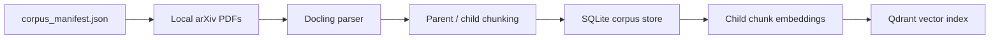
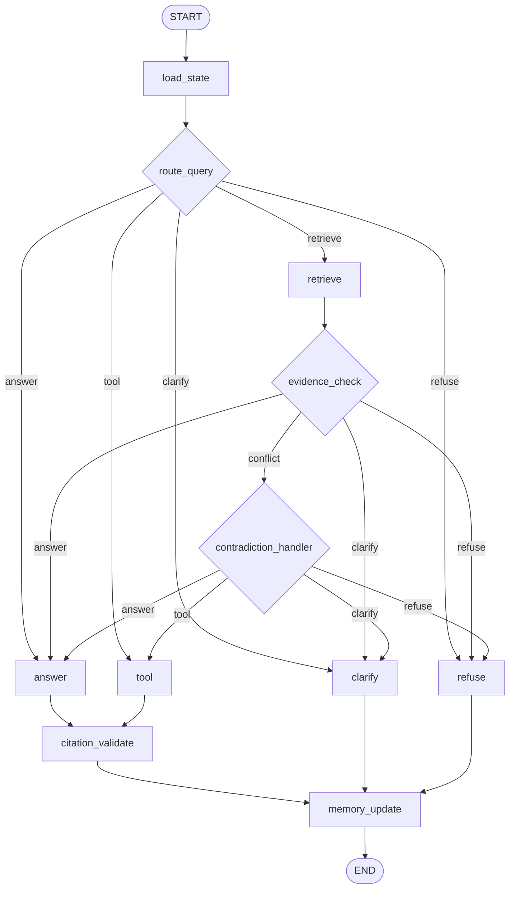
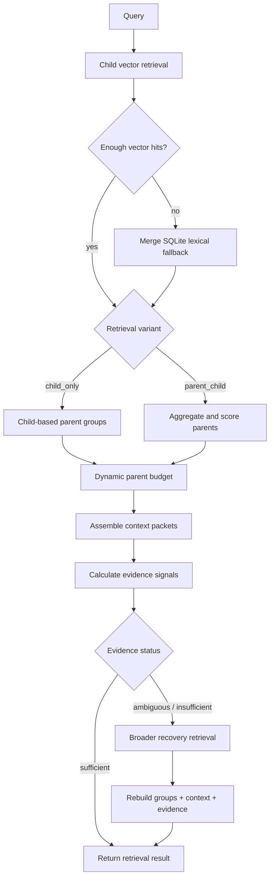

# Agentic RAG — Retrieval, Grounding, and Agent Reliability Experiments

An experimental local-first agentic RAG system over a fixed corpus of recent arXiv research papers. The project explores retrieval structure, evidence-aware routing, failure recovery, citation grounding, memory, tool use, tracing, and behavior-oriented evaluation.

## Why this project exists

This started as a small hack project and gradually became a testbed for experimenting with RAG and agent-system behavior. Instead of optimizing around a single chatbot demo, I used the repository to explore what happens when retrieval, evidence assessment, tool routing, citation validation, memory, recovery paths, and evaluation are modeled explicitly.

The focus is therefore less on presenting a finished end-user product and more on making the system's decisions inspectable: what information was retrieved, whether the available evidence was sufficient, why the graph answered or refused, what was carried across a thread, and where different retrieval strategies fail.

## What this repository explores

- **Retrieval structure:** child-only retrieval versus parent-child retrieval with parent aggregation and context assembly.
- **Evidence-aware behavior:** evidence signals determine whether the system answers, clarifies, refuses, or attempts broader retrieval.
- **Grounded generation:** answers are tied to explicit context packets and pass deterministic plus optional LLM-assisted citation checks.
- **Tool routing:** arXiv metadata and search requests use structured tools instead of the document-retrieval path.
- **Memory:** thread-scoped LangGraph checkpoints are combined with semantic decision memory and episodic turn records.
- **Failure handling:** retrieval recovery, safe fallbacks, contradiction handling, and fail-closed citation behavior are explicit parts of the flow.
- **Observability:** structured trace events capture routing, retrieval, evidence, tool, citation, memory, and final-action decisions.
- **Evaluation:** curated behavioral cases and a child-only versus parent-child ablation are used to inspect system behavior and failure modes.

## Project evolution

This repository changed substantially during development: it started with local BGE-M3 embeddings, live arXiv corpus discovery, custom conversation persistence, and simpler agent control paths; later iterations moved to OpenAI embeddings, a fixed hash-verified corpus, LangGraph checkpoints, structured LLM decisions, layered citation validation, and retrieval recovery. Child-only and parent-child retrieval were implemented as comparison strategies rather than treating either one as universally correct.

The reconstructed engineering history, including approaches that were replaced and the limits of the recorded ablation, is documented in [`docs/EXPERIMENTS.md`](docs/EXPERIMENTS.md).

## Scope

**Designed for**
- Questions grounded in the repository's fixed research-paper corpus.
- Synthesis across indexed paper content.
- arXiv metadata/search requests through the tool path.
- Follow-up questions within a reused `--thread-id`.

**Not designed for**
- General web search or arbitrary world knowledge.
- Claims that cannot be supported by the indexed corpus or tool result.
- Production deployment as currently packaged.
- Treating the existing evaluation set as a comprehensive RAG benchmark.

## Project summary

Local-first CLI agentic RAG system over recent arXiv `cs.AI` papers, designed for grounded answers with citations, clarification/refusal behavior, inspectable traces, and behavior-first evaluation.

## What this system can and cannot answer

Can answer:
- Questions grounded in indexed recent `cs.AI` papers.
- Metadata/search requests via arXiv tool route.
- Follow-ups inside a shared `--thread-id` using LangGraph SQLite checkpoints + episodic memory.

Cannot answer:
- General web knowledge outside indexed corpus.
- Unsupported certainty when evidence is weak.
- Non-corpus domains (weather, finance, etc.).

### Local requirements

- Python 3.11+
- `uv`
- Docker / Docker Compose
- OpenAI API key for indexing/query embeddings and configured LLM calls

The system is local-first in storage and orchestration, not fully offline: SQLite and Qdrant are local, while the current embedding/LLM implementations use OpenAI and corpus download/tool routes may use arXiv.

## Quickstart

```bash
cp .env.example .env
uv sync
docker compose up -d qdrant
uv run app db init
uv run python scripts/download_corpus_pdfs.py
uv run app ingest --limit 100
uv run app index
uv run app ask "What do recent papers say about agent memory?" --thread-id demo --debug
uv run app --help
```

Before `app index`, configure `OPENAI_API_KEY` in `.env`. Corpus PDFs are defined by the committed manifest and verified against pinned SHA-256 values when downloaded.

For the full configuration reference, data layout, dependency matrix, and reset behavior, see `docs/CONFIGURATION.md`.

## Demo commands

```bash
uv run python scripts/download_corpus_pdfs.py
uv run app ingest --limit 100
uv run app index
uv run app ask "What do recent papers say about agent memory?" --thread-id demo --debug
uv run app eval run --variant child_only
uv run app eval run --variant parent_child
uv run app eval compare --baseline child_only --candidate parent_child
uv run app trace list --last 10
```

## Architecture

The system separates corpus preparation from query-time agent execution. Corpus ingestion builds a reproducible parent/child document representation and vector index, while query-time execution uses an explicit state graph for routing, retrieval, evidence assessment, tool use, citation validation, memory, and failure handling.

### Corpus and indexing



- The manifest pins the corpus used for ingestion and evaluation instead of depending on live discovery at runtime.
- Parsed papers are represented as larger parent sections plus smaller child chunks used for retrieval.
- Corpus metadata and document structure live in SQLite; child embedding vectors are indexed in Qdrant.
- Ingestion and indexing are separate operations so embedding work remains explicit and repeatable.

### Query-time agent graph



Routing is explicit rather than forcing every query through retrieval. Retrieval questions go through evidence assessment before an answer is permitted. Tool requests use the arXiv tool path. Citation validation runs after generated/context answers and tool answers. Clarification and refusal are first-class terminal behaviors. Memory updates happen before the graph completes. Conversation state is checkpointed by thread_id.

### Retrieval and recovery



Vector retrieval operates over child chunks. The lexical path is a fallback when too few vector hits are returned; do not call it a full hybrid ranker. `parent_child` aggregates multiple child hits into parent-level evidence; `child_only` exists as the comparison baseline. Context assembly uses a bounded/dynamic parent budget. Evidence sufficiency is based on retrieval signals rather than simply assuming that retrieved documents are adequate. Ambiguous or insufficient evidence triggers one broader retrieval attempt before the result is returned. Recovery retrieval is internal to the retrieval service, not a separate agent node.

### State and persistence

| Concern | Storage / mechanism |
|---|---|
| Corpus metadata and chunks | SQLite |
| Child vectors | Qdrant |
| Conversation state | LangGraph SQLite checkpoints keyed by `thread_id` |
| Semantic decision memory | SQLite |
| Episodic turn records | SQLite |
| Structured traces | SQLite |
| Eval cases and results | SQLite + generated reports |

This split was intentional: Qdrant handles vector similarity search, while relational state, evaluation artifacts, memory, checkpoints, and traces remain locally inspectable.

## Design rationale

The project deliberately keeps several decisions explicit so they can be inspected and compared rather than hidden inside a single retrieve-and-generate pipeline.

| Decision | Rationale | Main trade-off |
| --- | --- | --- |
| Fixed local corpus | Keeps ingestion and evaluation repeatable across runs | Corpus must be deliberately refreshed |
| Child retrieval + parent context | Uses small units for search while restoring section-level context for generation | Parent expansion consumes additional context |
| Conditional lexical fallback | Gives sparse vector retrieval a simple exact-term recovery path | It is heuristic fallback merging, not full hybrid ranking |
| Evidence gate + recovery | Distinguishes "retrieved something" from "enough evidence to answer" | Thresholds and recovery policy are heuristic |
| Explicit routing | Separates corpus QA, tool use, clarification, and refusal | Routing quality depends on rules, thresholds, and model behavior |
| Layered citation validation | Combines deterministic citation invariants with optional semantic checking | Semantic validation can fail closed on valid-looking answers |
| Three memory concerns | Keeps conversation state, reusable semantic records, and turn history conceptually separate | Persistence becomes more complex |
| SQLite + Qdrant split | Keeps vector search specialized while application state remains locally inspectable | Two stores must remain consistent |
| Structured tracing | Makes intermediate agent decisions inspectable after a run | Trace storage and inspection add overhead |

These choices are not presented as universal best practices. Several are deliberately simple heuristics used to make behavior measurable and failure modes visible. See [`docs/DECISIONS.md`](docs/DECISIONS.md) for the implementation details and trade-offs.

## Design decisions

See [`docs/DECISIONS.md`](docs/DECISIONS.md) for the current design decisions and trade-offs.

## Corpus and ingestion

- Corpus scope: locked manifest in `corpus_manifest.json` (100 papers by default).
- Download missing/corrupt PDFs: `uv run python scripts/download_corpus_pdfs.py`
- Ingest command: `uv run app ingest --limit 100`
- Output: paper metadata, parent sections, child chunks, parse/chunk metadata in SQLite.

## Retrieval strategy

- Baseline: child-only dense retrieval.
- Candidate: parent-child retrieval with parent scoring.
- Parent score: max child score + capped support bonus + section adjustment - references penalty.

## Agent loop and memory

- LangGraph nodes: load state, route, retrieve/tool, evidence check, answer/refuse/clarify, citation validation, memory update.
- Three-layer memory:
  - Conversation memory (LangGraph SQLite checkpoint state scoped by `thread_id`).
  - Semantic decision memory (`semantic_memories`).
  - Episodic trace memory (`episodes`).
- Thread scope: `uv run app ask "..." --thread-id demo`.

## Evaluation

The repository includes a small behavior-oriented evaluation suite intended to expose routing, grounding, refusal, tool-use, and retrieval-strategy failures. It is useful as an engineering regression suite, but it is not a comprehensive RAG benchmark.

### Evaluation set

- 16 curated cases.
- Categories covered: content QA, synthesis/comparison, follow-ups, ambiguity, refusal, and arXiv tools.
- Cases are stored in `src/agentic_rag/evals/cases.yaml`.
- The current cases do not contain labelled expected paper/parent relevance IDs.

### What is currently scored

| Signal | Current status |
| --- | --- |
| Route correctness | Scored |
| Final action correctness | Scored |
| Answer/refuse/clarify behavior | Scored |
| Citation presence/mechanics | Scored |
| Tool selection | Scored |
| Retrieval presence | Coarse behavioral check |
| Labelled retrieval relevance | Not currently available in the 16-case set |
| Memory quality | Not currently scored |
| Trace quality | Not currently scored |

### Recorded results

| Metric | child_only | parent_child |
| --- | ---: | ---: |
| Cases | 16 | 16 |
| Normalized score | 95.62 | 96.25 |
| Raw score | 153.00 | 154.00 |
| Route accuracy | 0.9375 | 0.9375 |
| Final-action accuracy | 0.9375 | 0.9375 |
| Hard-fail refusal | false | false |
| paper_hit@k | 1.0 | 1.0 |
| parent_hit@k | 1.0 | 1.0 |
| parent_mrr | 0.7500 | 0.7500 |
| context_token_count | 722.75 | 959.50 |

These numbers should be interpreted as behavioral regression results, not as proof that one retrieval strategy is generally superior.

- Both variants recorded the same route accuracy, final-action accuracy, paper hit value, parent hit value, and parent MRR in this run.
- `parent_child` assembled more context: the reported `context_token_count` increased from 722.75 to 959.50; this field is currently a whitespace-based context-size approximation rather than tokenizer-exact usage.
- The +0.62 normalized-score difference came from `e15_tool_search`, where the LLM citation validator behaved differently after the same successful tool route; it was not a parent-child retrieval win.

### What the evaluation does not yet measure well

- relevance-labelled Recall@K / Precision@K / NDCG
- meaningful relevance-based MRR for the current unlabeled case set
- answer faithfulness/groundedness beyond the existing citation and behavior checks
- memory quality
- trace/trajectory quality
- run-to-run statistical stability
- tokenizer-exact context consumption
- evaluation isolation across repeated runs sharing checkpoint state

Detailed results and trace-backed failure analyses are in [`docs/EVAL_REPORT.md`](docs/EVAL_REPORT.md) and [`docs/ABLATION_REPORT.md`](docs/ABLATION_REPORT.md).

## Tracing and observability

Agent behavior is recorded as local structured traces so a run can be inspected beyond its final answer. The goal is debugging and experiment analysis rather than providing a full production observability platform.

| Area | Examples of recorded information |
| --- | --- |
| Run lifecycle | trace/thread/turn IDs, run mode, start/completion, failures |
| Routing | action, confidence, routing mode, reason, model/schema, latency |
| Retrieval | variant, child-hit count, selected parents, scores, evidence state, latency |
| Evidence | sufficiency/confidence, conflict state, resulting action |
| Tools | tool name, structured arguments, status, result count/summary, latency event |
| Citations | deterministic validation, optional LLM verdict, final validation state |
| Memory | checkpoint reads, semantic/episodic reads, write decisions, episode/checkpoint persistence |
| LLM calls | model/schema, status, latency, error where recorded |
| Evaluation | case start, scoring, completion |

### Inspecting a run

```bash
uv run app trace list --last 10
uv run app trace show <trace_id>
```

- `trace list` shows recent trace metadata.
- `trace show` reconstructs the ordered generic event stream and decoded payloads for one trace.
- `app ask ... --debug` prints a compact final-state summary including routing, retrieval, evidence, memory-read counts, selected context, and latency fields.

### Storage model

SQLite stores the generic trace/event stream and also has dedicated retrieval, tool, evidence, and answer trace tables. The current CLI reader exposes the generic event stream; the specialized tables are primarily persisted for structured inspection and future tooling.

### Current observability boundaries

- This is local application tracing, not OpenTelemetry or distributed tracing.
- No trace dashboard, metrics backend, alerting, sampling, or retention policy is implemented.
- Token and inference-cost accounting are not part of the current trace model.
- Trace/trajectory quality is not currently scored by the evaluation suite.
- Supported arXiv tool executions persist measured latency in both the generic completion event/debug state and the dedicated structured tool trace.
- Structured `answer_traces` do not currently represent every clarification/refusal outcome.
- `trace show` currently reads the generic event stream rather than joining all specialized trace tables.

See `docs/TRACE_EXAMPLES.md` for the event taxonomy and example flow shapes.

## Testing

The repository has a pytest suite focused on retrieval/evidence logic, agent policy, memory/checkpoint behavior, ingestion/indexing, structured LLM requests, arXiv tools, CLI wiring, and evaluation plumbing. Most external dependencies are replaced with fakes or mocked clients so deterministic project behavior can be tested without live services.

```bash
uv run pytest
uv run ruff check .
```

These checks were not rerun during the current documentation cleanup, so no current passing-test count or coverage percentage is claimed here.

See `docs/TESTING.md` for the coverage map, testing style, known maintenance items, and current test boundaries.

## Known limitations

See `docs/LIMITATIONS.md`.

## What I would improve with more time

- Better follow-up resolution across longer threads with stronger summary refresh logic.
- Additional citation repair strategies while preserving strict deterministic safety gate.
- Larger eval set for stronger threshold calibration.
- Richer trace visualization tooling.

## Structured outputs + local reset notes

- Schema-bound LLM calls use OpenAI Responses API strict structured parsing (`responses.parse` with Pydantic models).
- Old local DB/Qdrant layouts are not kept backward-compatible for this change. Reset local data:

```bash
uv run app db reset --yes
docker compose down
rm -rf data/qdrant
docker compose up -d qdrant
```
